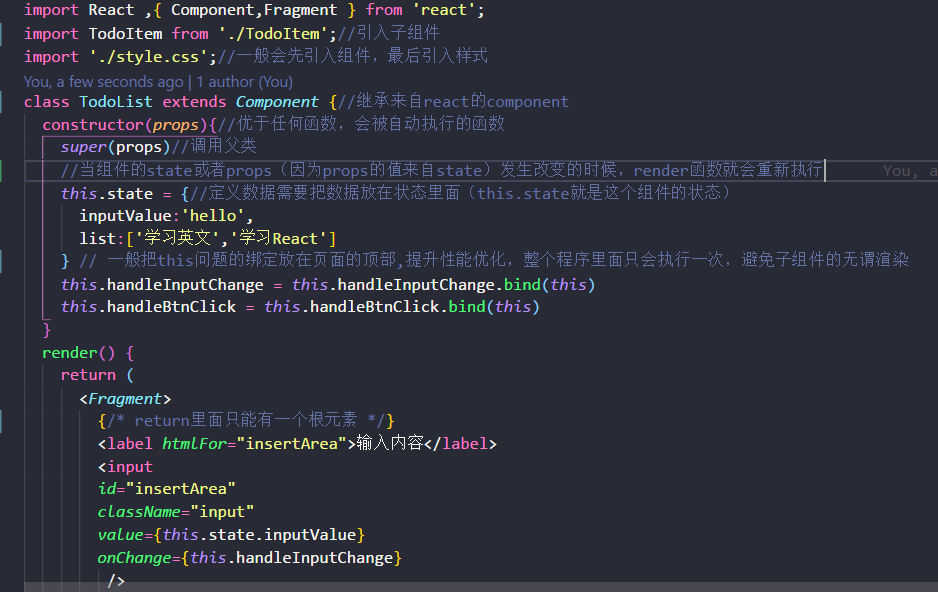
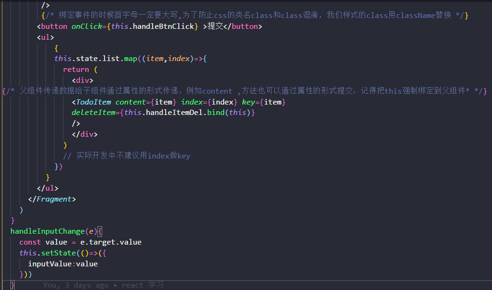

 # React 学习
 早在一年前就有接触过 `react`，那时候我的知乎大神一直在推广 `react`，只是那时候的我刚刚入门前端，`ES6` 不熟，演绎了一场入门到放弃。后来因为毕业设计的原因入坑 `vue`，入职写 `vue` ，每次和朋友讨论的时候我只会说一句我只会 `vue` ，似乎我好像就局限在我曾引以为傲的 `vue` 中，心疼的是我 `vue` 好像也并没有那么厉害。不把自己局限在 `vue` ，感受接受其他框架的力量。

 一直听说 `vue` 借鉴了其他两大框架的优点，真实情况我并不了解，因为我只会 `vue`，才入坑 `react`。可能是语言都是想通的，`vue` 没有我想象中那么高攀不起。

 `vue` 中所有文件后缀名是 `.vue`,`react` 的文件直接是 `js` ，他们的引入方式一样，`react` 使用 `JSX` 语法，`vue` 和原生的更像。
 
 对比 `vue` 学习 `react`  

在 `vue` 中，所有的数据定义在 `data()`，所有的`this` 指向 `vue` 构造函数（箭头函数除外），没有 `this` 绑定的问题，`html` 代码写在`<template>` 元素当中，`js` 写在 `<script>`，`css` 写在 `<style>`，所有的方法函数写在了 `methods` 里面。在`html` 元素当中，引用 `class` 类名，可以直接写 `class`，父子组件传值的方式类似，都可以有数据类型验证，都是单项数据传递，子组件触发父组件的方式有一点点区别，`vue` 通过`on` 和 `emit` ，`react` 直接通过 `this.props` 

 

`react` 有他的生命周期函数，我们可以通过 `console.log()` 或者 `debugger` 看生命周期的运行时间

简单粗暴的说 `react` 生命周期函数里面最重要的是  `render()` 这个钩子函数（所有的生命周期都可以不存在，除了 `render` 函数除外，因为`react.Component` 函数默认内置了其他函数，但是没有内置 `render` 函数），我们元素的书写，组件的使用，都是在那个里面进行。所有的方法就直接和生命周期在同一层级（好像和小程序的生命周期函数和方法结构是一样的）。

