 早在一年前就有接触过 `react`，那时候我的知乎大神一直在推广 `react`，只是那时候的我刚刚入门前端，`ES6` 不熟，演绎了一场入门到放弃。后来因为毕业设计的原因入坑 `vue`，入职写 `vue` ，每次和朋友讨论的时候我只会说一句我只会 `vue` ，似乎我好像就局限在我曾引以为傲的 `vue` 中，心疼的是我 `vue` 好像也是一直停留在初学者水平。不把自己局限在 `vue` ，感受接受其他框架的力量。

 一直听说 `vue` 借鉴了其他两大框架的优点，真实情况我并不了解，因为我只会 `vue`，才入坑 `react`。可能是语言都是想通的，`vue` 没有我想象中那么高攀不起。

 `vue` 中所有文件后缀名是 `.vue`, `react` 的文件直接是 `js` ，他们的引入方式一样，`react` 使用 `JSX` 语法，`vue` 和我们写原生的 `html` 更像,把 `css JS HTML` 放在一个组件里面，而 `react` 是写 `js` 一样书写组件
放两张对比图，是我在学 `react` 时候的笔记

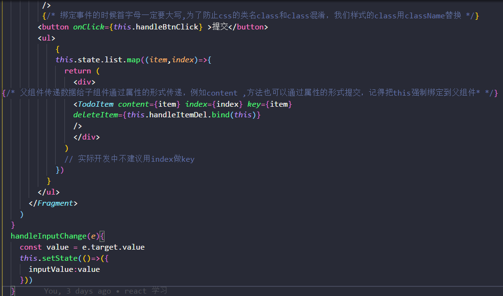
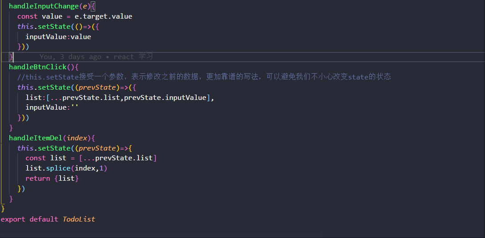
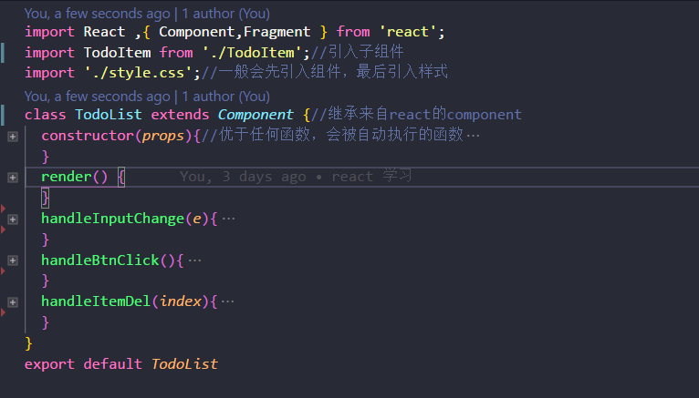
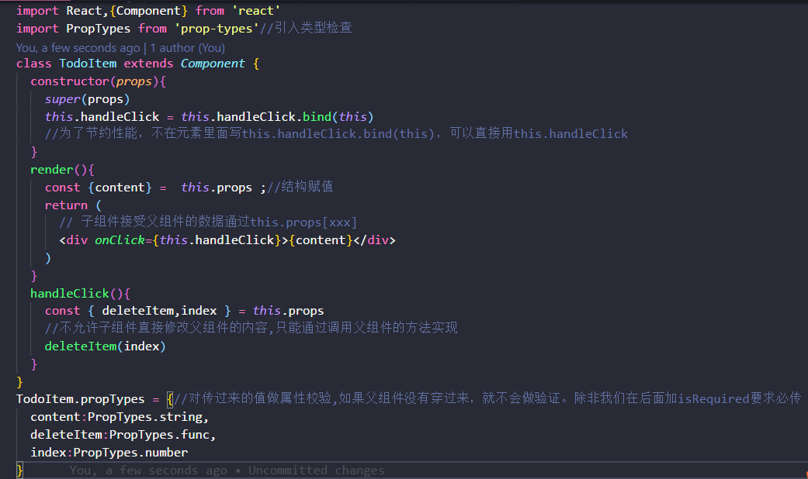

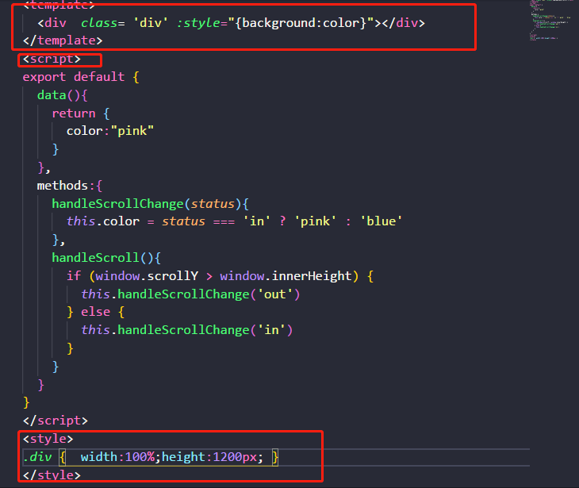
在 `vue` 中，所有的数据定义在 `data()`，所有的`this` 指向 `vue` 构造函数（箭头函数除外），没有 `this` 绑定的问题，`html` 代码写在`<template>` 元素当中，`js` 写在 `<script>`，`css` 写在 `<style>`，所有的方法函数写在了 `methods` 里面。在`html` 元素当中，引用 `class` 类名，可以直接写 `class`，父子组件传值的方式类似，都可以有数据类型验证，都是单项数据传递传递方式也是一样的，子组件触发父组件的方式有一点点区别，`vue` 通过`on` 和 `emit` ，`react` 直接通过 `this.props` ; `react` 绑定事件用类似原生的写法，只是首字母大写(onClick) ,`vue` 用 `@click` .....

## 生命周期
`vue` 有他的生命周期，在每个时期都有相对应的钩子函数，这样我们就可以在相对而言更加适合的时机做适合的事。


在工作中用的最多的是 `mounted` 渲染数据，`beforeDestroy` 在销毁组件的时候释放一些定时器或者其他资源会用到。其他的好像用的相对而言比较少。

`react` 也有他的生命周期函数，每一个版本钩子函数有一点点小小小的区别，但是我们常用的那些个钩子函数一直存在

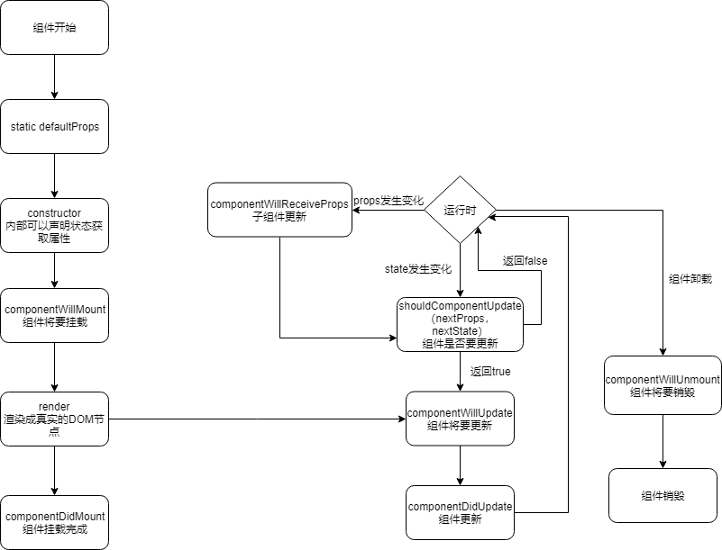

我们通过 `console.log` 日志来看看，这些钩子函数在什么时候执行


在 `console.log` 日志中我们大概可以明白，生命周期可以分成三大块，初次渲染，组件更新，组件销毁。 为什么组件销毁还要执行呢？因为要资源释放。作为一个合格的前端，是不允许控制台有任何警告性的提示出现的。如果组件占用的资源在组件销毁的时候没有释放会怎么样？


避免这样的警告一句话就解决了，控制台干干净净，代码整整齐齐，心情美美哒


[案例DOM](https://github.com/sunseekers/React/blob/master/DEMO/react/src/life.js)

仔细看 `案例DOM` ，你会发现里面有一个怪异的语法，或许你会问我这是什么东西？

```
  handleChange=()=>{
    this.setState((preState)=>({
      count:preState.count+1
    }))
  }
```
这是 `ES7` 语法，官方文档中有说哟


`react` 生命周期函数里面最重要的是  `render()` 这个钩子函数（所有的生命周期都可以不存在，除了 `render` 函数除外，因为`react.Component` 函数默认内置了其他函数，但是没有内置 `render` 函数），我们元素的书写，组件的使用，都是在那个里面进行。所有的方法就直接和生命周期在同一层级（好像和小程序的生命周期函数和方法结构是一样的）

通过和 `vue` 的生命周期函数一对比，发现好像是差不多的。只是在写法上不一样而已。在我们的项目中，数据的获取都是接口请求获取异步数据的，那么我们在哪一个生命周期函数里面去写更好一点呢？？我推荐 `componentDidMount()` 。如果你想组件从加载到成功渲染是如何一步一步执行的，我们可以在每一个钩子函数里面打一个断点，这样清晰可见。`console.log` 日志我们只可以看到钩子函数执行的先后

## ref
如果你写过 `vue` 应该用过 `ref` 这个东西。在 `react` 中 `ref` 含义是一样的，只是语法写的不一样。`ref` 是什么？我的理解是一个引用，一个别名，一个ID，用来获取数据，操作方法。他让父组件的兄弟组件中去调用子组件的方法。在我的工作中用的还是比较多的。

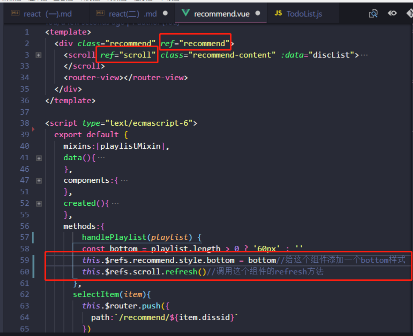

[案例DOME](https://github.com/sunseekers/QQMusic/blob/master/src/components/add-song/add-song.vue)

那么在 `react`中 `ref` 的又是如何使用的呢？

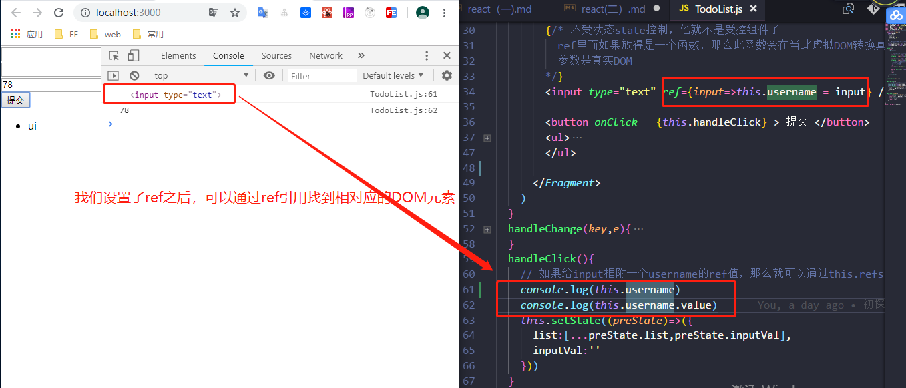
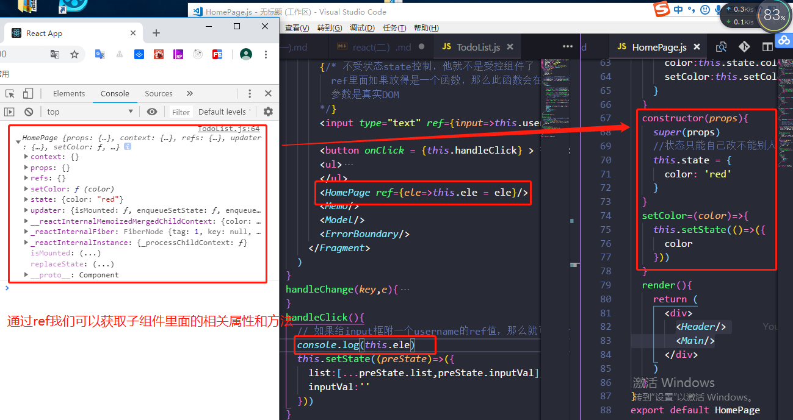

说白了就是在组件上面加上一句话 `ref={val=>this.name = val}` 里面的 `this.name` 是我自己定义的，`name` 可以换成其他的名字。`this.name` 就牵引着这个组件，里面的数据方法属性，我们都可以获取到[案例DOME](https://github.com/sunseekers/React/blob/master/DEMO/react/src/TodoList.js)

## 插槽
我首先接触的是 `vue` ，在学习 `react` 的时候我总在想，`vue` 里面有的东西，`react` 里面有没有呢？文档证明是真的有。

在 `vue` 中写基础组件的时候，插槽这东西用的比较多。在写基础组件的时候总会考虑到，有那么一两个特别，需要特殊处理，而大部分的时候是不需要处理的，这时候我们就需要在基础组件里面预留一个位置，这样就不要再重新写一段差不多的代码了。在 `react` 中也存在这东西，用法都差不多。

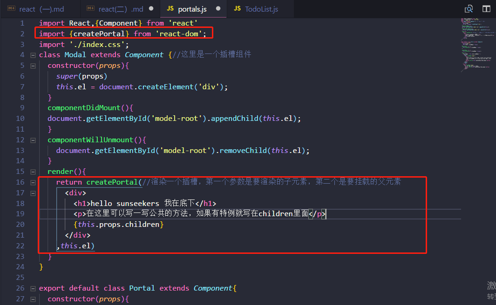
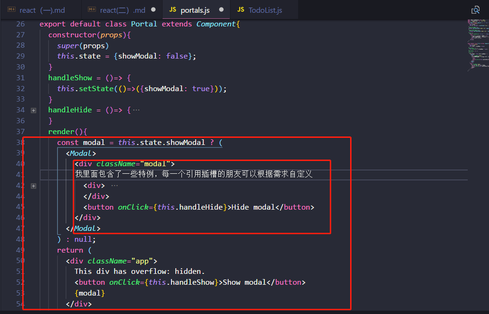

写插槽类的时候我们首先要引入 `createPartal` 这个组件，这个组件接受两个参数，第一个是要渲染的子元素(包括共有的和占位元素 `this.props.children`)，第二个是要挂载的元素。
[案例DOME](https://github.com/sunseekers/React/blob/master/DEMO/react/src/portals.js)

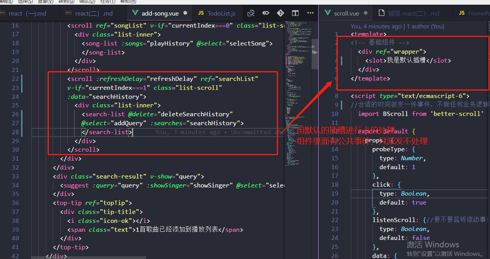

直接用一个无名的 `<slot></slot>` 元素进行占位，具体是什么根据需求场景而定。如果没有占位元素，浏览器会报错。[案例DOME](https://github.com/sunseekers/QQMusic/blob/master/src/base/scroll/scroll.vue)

当我们页面需要用到一些基础组件或者说是公共组件的时候，我们可以考虑用插槽来处理某些特殊情况，而不是再写一次重复的代码

如果学过这两个框架的就会发现，其实他们的数据流，组件化，生命周期，状态更新都是差不多的，只是语法不一样而已；`vue` 框架帮我们做了大部分的事情 `api` 多，`react` 框架更多的事情都是我们自己动手去做，去写。可能是因为工作是写 `vue` 的，或者是 `react` 的初学者，个人认为 `vue` 写起来更加简单方法，毕竟那是在自己熟悉的领域，哈哈。好像会慢慢的喜欢上 `react`