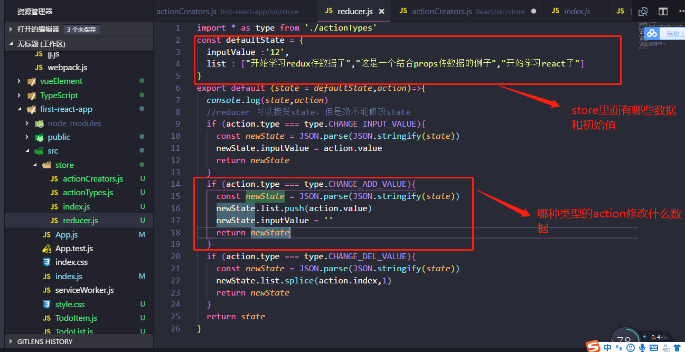

## 生命周期
`vue` 有他的生命周期，在每个时期都有相对应的钩子函数 


`react` 也有他的生命周期函数，每一个版本钩子函数有一点点小小小的区别，但是我们常用的那些个钩子函数一直存在
我们通过 `console.log` 日志来看看，这些钩子函数在什么时候执行


在 `console.log` 日志中我们大概可以明白，生命周期可以分成三大块，初次渲染，组件更新，组件销毁。 为什么组件销毁还要执行呢？因为要资源释放。作为一个合格的前端，是不允许控制台有任何警告性的提示出现的。如果组件占用的资源在组件销毁的时候没有释放会怎么样？


避免这样的警告一句话就解决了，控制台干干净净，代码整整齐齐，心情美美哒


[案例DOM](https://github.com/sunseekers/React/blob/master/DEMO/react/src/life.js)

仔细看 `案例DOM` ，你会发现里面有一个怪异的语法，或许你会问我这是什么东西？

```
  handleChange=()=>{
    this.setState((preState)=>({
      count:preState.count+1
    }))
  }
```
这是 `ES7` 语法，官方文档中有说哟


通过和 `vue` 的生命周期函数一对比，发现好像是差不多的。只是在写法上不一样而已。在我们的项目中，数据的获取都是接口请求获取异步数据的，那么我们在哪一个生命周期函数里面去写更好一点呢？？我推荐 `componentDidMount()` ，

## state
既然是异步获取数据，如果我们一股脑子都写在了`componentDidMount()`，是没有问题的，但是作为一个有追求的前端，在长远角度我们更加喜欢好维护的代码。我通常建议数据视图分开

在一个复杂的项目中，我们有大量的数据需要维护修改，每次数据修改 `render()` 都会被更新。秉持数据视图分开的原则，我建议使用 `state` 仓库来管理数据。把我前面说的接口异步请求也放在这个里面


看图说话，我们假设这是一个图书馆管理系统，`react Component` 就是用户（借书人），他要借书就会创建一个行为 `Action creators` ，行为就会触发一个动作 `dispatch(action)` ，告诉图书馆管理员（`state`），用户要借的书。`state` 拿着用户要借的书去数据库里面查 `reducers` ，数据库会把最后的结果告诉图书馆管理员（`state`），图书管理员在把结果告诉给用户。

看上去好像有点麻烦，多写两遍就好了。熟能生巧。流程图中有四个步骤，那我们也应该要建立四个文件，就和 `vuex` 的数据管理有一点点的类似，但是他们又各有各的特色


