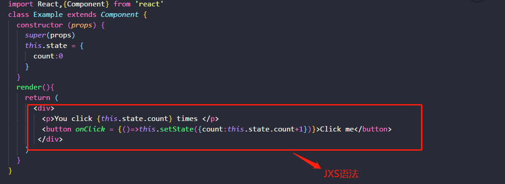
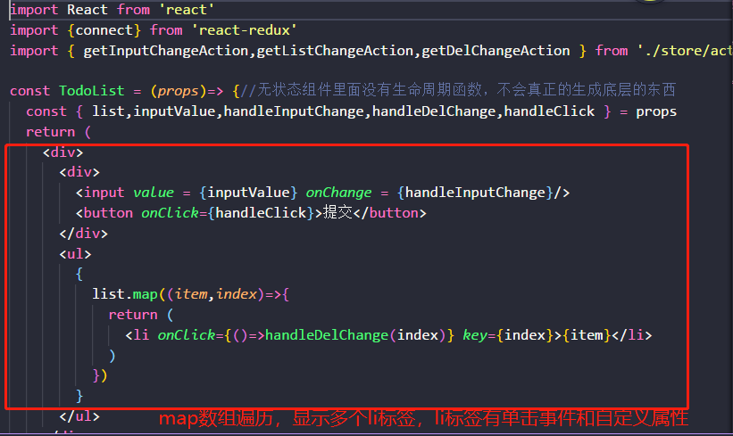
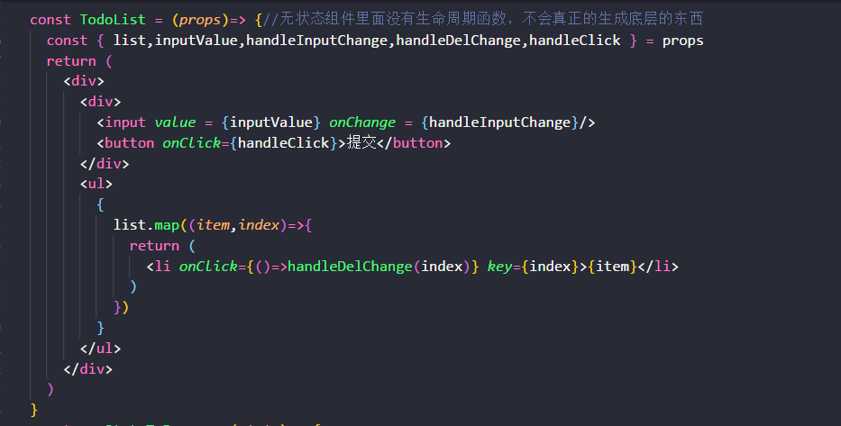
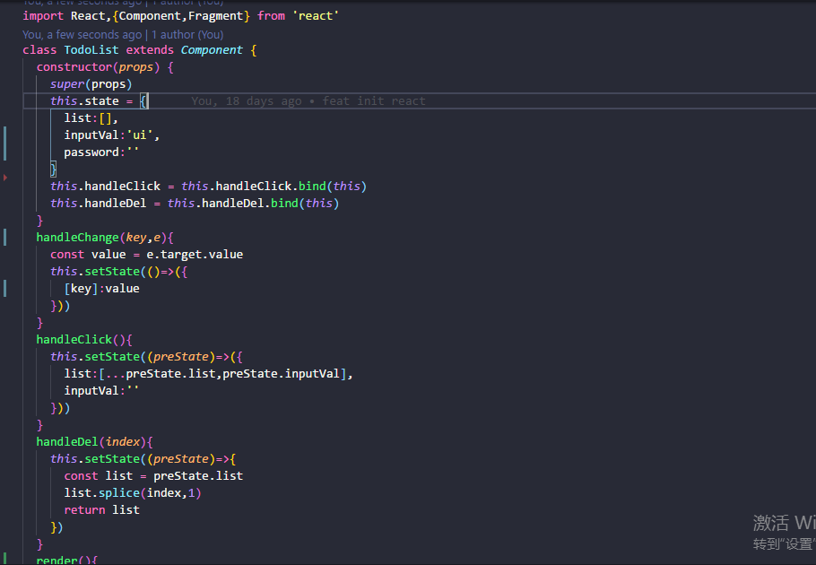
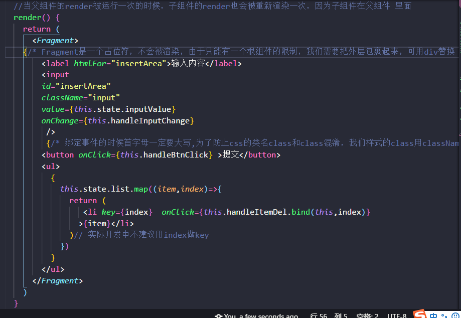
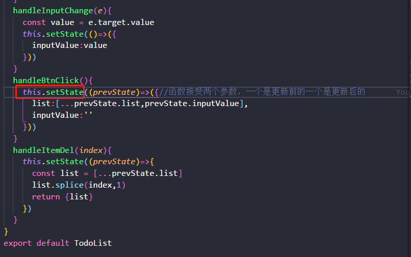
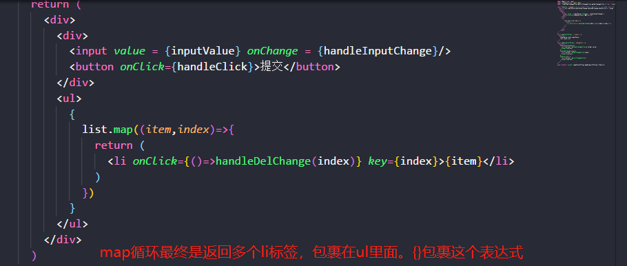
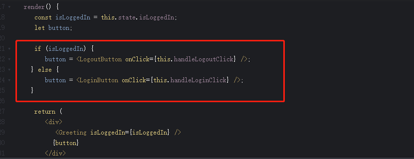
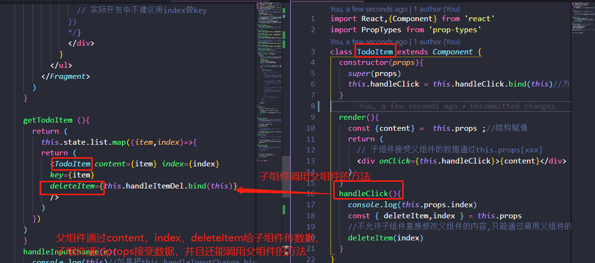

18 年没剩几天了，依稀记得年初的时候我还在学 `vue` ，年末了我却入坑 `react`，我以为我永远都不会入坑 `react`，可是我错了。在工作中只用 `vue` ，业余时间学习 `react` , `TypeScript` ,小程序，在目前的工作中不会用到，但并不代表以后不会用。我知道会一个框架没有用，会几个框架也没有用，能够在不同的业务解决不同的问题才是精华所在。我们最终都是要归根于公司的，公司用什么我们学什么，入职这家公司用这个我们学这个，入职那家公司我们学那个。工作需要什么我们学什么，框架说到底都是库，死磕文档就好了（大佬说的），道理是这样的。

那我为什么还要学习呢？脑海里回荡起领导说的一句话：我们在这家公司工作是为了下家工作做准备的，学到东西是重点，不要认为没有用（领导是 `java`，曾教我`Linux`系统简单命令）。最近好像听说好些公司裁员了，面对未来的不确定最好的方式是时刻准备着

## `JSX`
`react` 推荐使用的是 `JSX` 语法；通过 `react` 编译他会把`JSX` 解析成 `JavaScript` 表达式

简单语法
```
const name = 'Josh Perez'
const element = <h1> Hello {name} </h1>
```
把元素标签拿出来，写成常量，标签内还可以接受变量，如上所示例子；既然他是 `JavaScript` 表达式，那么就可以在 `if` 或者 `for` 循环中使用了
 
```
function GetGreeting(user) {
  if (user) {
    return <h1> hello world </h1>
  }eles {
    return <h1>hello sunseekers</h1>
  }
}
```
`JSX` 是把元素标签赋值给一个常量，那么元素标签应该有的属性他都存在，就和我们平时使用元素一样；

```
const element = <div tabIndex = '0'></div>
const img = 
```

组件名称总是大写字母开始，为了区分组件和 `DOM` 标签
我自己简单粗暴的理解 `JSX` 就是用 `js` 的形式把 `html` 搬移过来，拥有 `javaScript` 和 `html` 原来所拥有的，然后 `react` 帮助你去解析
在项目中的使用




`react` 里面大量使用 `ES6` 的语法书写，如果你 `ES6` 不太熟悉，我建议你去了解一下。对于 `ES6` 的相关知识一笔带过。

既然我们了解了 `JSX` 的简单语法，那么在项目中如何使用呢？
## 组件

在 `react` 中组件可以有两种形式的写法，就像创建函数有函数声明和函数表达式两种方式。`react` 创建组件也有两种形式：有状态组件（有 `class` 的）和无状态组件或者说函数式组件（有 `function` ）

> 无状态组件 ( 函数式组件 )
```
function Welcome(props) {//定义数据来自父组件传递
  return <h1> Hello {props.name} </h1>
}
```
> 有状态组件
```
class Welcome extends React.Component {
  construction(props){//构造函数优于任何函数，会被自动执行的函数，所有class都有的函数
    super(props)//调用父类
    this.state = {//定义组件需要的数据放在状态里面获取
      name: 'sunseekers'
    }
  }
  render() { //把虚拟的DOM节点，渲染成真实的DOM节点。当组件的state或者props（因为props的值来自state）发生改变的时候，render函数就会重新执行
    return <h1>hello, {this.state.name}</h1>
  }
}
```

有状态组件和无状态组件的区别：
> 无状态组件里面没有内置 `react` 的生命周期函数，所有更加纯粹，轻便相对而言性能会更好。

> 有状态组件继承 `react.Component` ，它默认内置了一些生命周期函数（唯独没有内置`render`生命周期函数函数），所以我们要在写组件的时候一定要写 `react` 这个生命周期函数否则会报错。

是不是以后我们写组件就直接写无状态组件了呢？并不是，每一种方式创建组件都有他存在的理由。具体需求具体使用，一般情况当我们的组件里面没有复杂逻辑，数据传递我们可以尝试使用，当一个组件只有 `render()` 生命周期的时候，我们完全可以用一个无状态组件来替换。下面是无状态组件和有状态组件





生命周期函数是指在某一时刻组件会自动调用执行的函数

## State
 `React` 很灵活，但是它有一条严格的规则  `reducer()` 生命周期函数( 或者说 `react` 组件 ) 必须是纯函数（纯函数，相同的输入，就一定会有相同的输出，并且不允许修改传进来的参数，在案例中我们要修改数据都借助 `state` 状态

 

 `state` 里面的数据我们不能直接修改，直接修改并不会重新渲染一个组件，我们需要借助 `setState()` ( 状态更新是异步的，解决这个问题我们常常在 `setState` 里面调用函数，函数接受两个参数，一个是更新前的一个是更新后的；不建议 `setState`  里面使用对象的形式,所以我就没有举例 )

`state`的使用很简单，在 `constructons()` 的构造函数中通过 `this.state` 声明，在函数方法里面直接`this.setState()`修改数据

 细心的朋友一定发现了，在案例中我们使用了循环渲染。通过使用数组的 `map`，在 `react` 里面可以使用条件渲染，循环渲染。`react` 中一个 {} 表示是一个 `js` 表达式，{{}}这种，外层表示  `js`  表达式，内层是  `js`  对象；

 
 
条件渲染也很简单，就和我们平常写 `js` 一样

 

 [if 案例](https://codepen.io/gaearon/pen/QKzAgB?editors=0010)

 在`JavaScript` 中 `true && expression` 总会执行 `expression` 。`flase && expression` 总会执行 `false`。在 `react` 也是一样的，三元操作符一样可以使用 `condition ? true : false `。

在 `vue` 中，表单的绑定实时渲染是作者帮我们封装好了，我们直接使用就好`v-model`，但是在`react`中，需要我们自己去写。自己写也是很简单的，在上面的例子里面我们已经写过了，不相信可以翻上去看看，哈哈

```
在vue中实现
<input
  :value="message"
  @input="message=$event.target.value">
<p>{{message}}</p>

data(){
  return {
    message:""
  }
}
在react中实现
<input value = {this.state.inputVal} 
        onChange = {(e)=>this.handleChange('inputVal',e)} />
<p>{this.state.inputVal}</p>
```
在`vue`里面不需要我们自己写表单相关的一些事件，`react`中表单相关的事件需要我们自己写。不管是作者帮我们写好了，还是自己写，原理都是一样的；

##数据传递
父组件给子组件传递数据是单项的，通过 `props` 进行数据传递 ,如果子组件要修改父组件的数据，只能通过子组件触发父组件的方法在父组件里面修改，一般情况子组件是不能直接修改父组件的数据。在 `vue` 和 `react`里面都是一样的，只是语法不一样。在 `vue` 中使用 `this.$emit()` 和 `this.$on()` 实现。`react` 里面也是类似的原理

 

留点东西下次再更新 `react` 。我是初学者请多多指教，有什么写的不对或者不好的欢迎评论指出。[案例DEMO](https://github.com/sunseekers/React/tree/master/DEMO)

最近有不少朋友问我如何学习 `vue`，[推荐一手资料](https://cn.vuejs.org/v2/guide/)。如果有一天你问我如何学习 `react` [推荐一手资料](https://react.css88.com/docs/react-component.html)